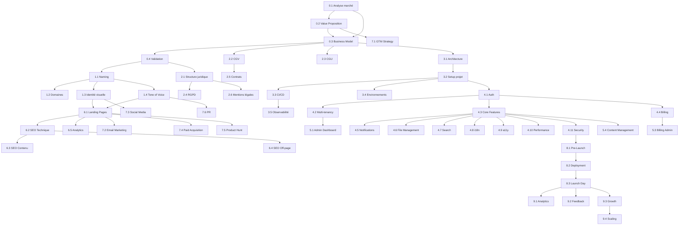

# UNICORNER - Product Requirements Document
## Plateforme de Lancement de Startups SaaS

**Version:** 1.0
**Date:** 2026-03-09
**Auteur:** Arnaud + Claude Code

---

## 1. Vision & Concept

**Unicorner** est une plateforme d'orchestration du lancement de startups SaaS. Elle prend en entrée une **idée** et une **description de service** (plus ou moins avancée), et produit en sortie un **workflow jalonné d'exécution** dont chaque étape est automatisée au maximum par Claude Code.

### 1.1 Inputs utilisateur
| Champ | Type | Obligatoire | Description |
|-------|------|-------------|-------------|
| `idea_name` | string | oui | Nom de travail de l'idée |
| `description` | text | oui | Description du service (pitch, fonctionnalités clés) |
| `target_market` | enum | oui | `FR` / `EU` / `US` / `INTL` |
| `business_model` | enum | oui | `B2B` / `B2C` / `B2B2C` |
| `language` | enum | oui | `fr` / `en` / `multi` |
| `budget_tier` | enum | non | `bootstrap` / `seed` / `series_a` |
| `tech_preferences` | object | non | Stack technique préférée |
| `competitors` | array | non | Liste de concurrents identifiés |
| `monetization` | enum | non | `freemium` / `subscription` / `usage` / `marketplace` |

### 1.2 Output principal
Un **projet structuré** avec :
- Workflow en N phases jalonnées
- Artefacts produits à chaque étape (fichiers, configs, code, documents)
- Dashboard de suivi d'avancement
- Intégration continue avec Claude Code pour chaque module

---

## 2. Architecture des Phases

Le lancement est découpé en **10 phases séquentielles**, chacune composée de **modules indépendants** pouvant être exécutés en parallèle au sein de leur phase.

```
PHASE 0: Discovery & Validation
PHASE 1: Identité & Branding
PHASE 2: Fondations Juridiques
PHASE 3: Infrastructure & Architecture
PHASE 4: Développement Produit (MVP)
PHASE 5: Backoffice & Admin
PHASE 6: Contenu & SEO
PHASE 7: Go-To-Market
PHASE 8: Lancement & Distribution
PHASE 9: Post-Launch & Growth
```

---

## 3. PHASE 0 — Discovery & Validation

**Objectif :** Valider l'idée, identifier le marché, définir le positionnement.

### Module 0.1 — Analyse de marché
- **0.1.1** Recherche concurrentielle automatisée (scraping, analyse des SaaS existants)
- **0.1.2** Analyse des tendances (Google Trends, Product Hunt, etc.)
- **0.1.3** Estimation TAM / SAM / SOM
- **0.1.4** Identification des segments cibles (personas)
- **0.1.5** Benchmark des prix du marché
- **Artefacts :** `docs/market-analysis.md`, `docs/competitors.md`, `docs/personas.md`
- **Automatisation Claude Code :** Recherche web, synthèse, génération des documents

### Module 0.2 — Value Proposition Design
- **0.2.1** Canvas de proposition de valeur
- **0.2.2** Définition des jobs-to-be-done
- **0.2.3** Pain points / Gains mapping
- **0.2.4** Unique Selling Proposition (USP)
- **0.2.5** Elevator pitch (30s, 2min, 5min)
- **Artefacts :** `docs/value-proposition.md`, `docs/pitch-deck-draft.md`
- **Automatisation Claude Code :** Génération itérative avec feedback

### Module 0.3 — Business Model Canvas
- **0.3.1** 9 blocs du BMC remplis
- **0.3.2** Revenue streams détaillés
- **0.3.3** Pricing strategy (tiers, features par plan)
- **0.3.4** Cost structure estimation
- **0.3.5** Unit economics (CAC, LTV, churn prévisionnel)
- **Artefacts :** `docs/business-model.md`, `docs/pricing-strategy.md`, `docs/unit-economics.md`
- **Automatisation Claude Code :** Calculs, projections, modèles financiers

### Module 0.4 — Validation rapide
- **0.4.1** Landing page de test (waitlist)
- **0.4.2** Script d'interviews utilisateurs
- **0.4.3** Questionnaire de validation (Typeform/Google Forms)
- **0.4.4** Métriques de validation (signup rate, NPS intent)
- **0.4.5** Go/No-Go decision framework
- **Artefacts :** `validation/landing/`, `docs/interview-script.md`, `docs/validation-results.md`
- **Automatisation Claude Code :** Génération landing, scripts, analyse résultats

---

## 4. PHASE 1 — Identité & Branding

**Objectif :** Créer l'identité complète de la marque.

### Module 1.1 — Naming
- **1.1.1** Génération de noms (brainstorming IA)
  - Critères : mémorable, prononçable (FR si marché FR, EN si INTL), pas de connotation négative
  - Génération de 50+ candidats
- **1.1.2** Vérification disponibilité domaines
  - TLDs prioritaires : `.com`, `.io`, `.co`, `.app`, `.dev`, `.fr` (si FR), `.eu` (si EU)
  - TLDs secondaires : `.ai`, `.so`, `.tech`, `.saas`
  - Vérification automatisée via API WHOIS / registrar
- **1.1.3** Vérification disponibilité marques
  - INPI (FR), EUIPO (EU), USPTO (US)
  - Recherche d'antériorité
- **1.1.4** Vérification disponibilité réseaux sociaux
  - Twitter/X, LinkedIn, GitHub, Instagram, TikTok, YouTube
  - Handle unifié si possible
- **1.1.5** Vérification linguistique multi-marchés
  - Pas de signification négative dans les langues cibles
- **1.1.6** Scoring et shortlist (top 5)
- **1.1.7** Décision finale utilisateur
- **Artefacts :** `brand/naming-candidates.md`, `brand/naming-decision.md`
- **Automatisation Claude Code :** Génération noms, vérification domaines (API), vérification handles

### Module 1.2 — Achat domaines & Setup DNS
- **1.2.1** Achat domaine principal (via API registrar : Namecheap, Cloudflare, OVH)
- **1.2.2** Achat domaines secondaires / protectifs
- **1.2.3** Configuration DNS initiale
- **1.2.4** Setup email professionnel (Google Workspace / Microsoft 365)
- **1.2.5** Configuration SPF, DKIM, DMARC
- **Artefacts :** `infra/dns-config.md`, `infra/email-setup.md`
- **Automatisation Claude Code :** Scripts d'achat et config DNS

### Module 1.3 — Identité visuelle
- **1.3.1** Brief créatif (mood board, références, valeurs)
- **1.3.2** Palette de couleurs (primaire, secondaire, neutres, sémantiques)
- **1.3.3** Typographies (heading, body, mono)
- **1.3.4** Logo
  - Logotype
  - Icône / Symbol
  - Variantes (dark, light, monochrome, favicon)
  - Formats (SVG, PNG @1x @2x @3x, ICO)
- **1.3.5** Design tokens (CSS variables / Tailwind config)
- **1.3.6** Charte graphique complète
- **Artefacts :** `brand/colors.md`, `brand/typography.md`, `brand/logo/`, `brand/design-tokens.json`, `brand/brand-guidelines.pdf`
- **Automatisation Claude Code :** Brief, design tokens, config Tailwind, favicon generation

### Module 1.4 — Tone of Voice & Copywriting Guidelines
- **1.4.1** Définition du ton (formel/informel, technique/accessible, etc.)
- **1.4.2** Glossaire de termes produit
- **1.4.3** Templates de communication (emails, notifications, erreurs)
- **1.4.4** Guidelines rédactionnelles
- **Artefacts :** `brand/tone-of-voice.md`, `brand/glossary.md`, `brand/copy-templates.md`
- **Automatisation Claude Code :** Génération complète

---

## 5. PHASE 2 — Fondations Juridiques

**Objectif :** Mettre en place tout le cadre légal.

### Module 2.1 — Structure juridique
- **2.1.1** Choix de la forme juridique (SAS, SASU, SA, etc. pour FR / LLC, C-Corp pour US)
- **2.1.2** Rédaction des statuts
- **2.1.3** Pacte d'associés (si multi-fondateurs)
- **2.1.4** Immatriculation (guide étape par étape)
- **2.1.5** Ouverture compte bancaire professionnel
- **2.1.6** Assurances (RC Pro, Cyber)
- **Artefacts :** `legal/statuts-draft.md`, `legal/pacte-associes-draft.md`, `legal/immatriculation-guide.md`
- **Automatisation Claude Code :** Génération des drafts, guides procéduraux

### Module 2.2 — CGV (Conditions Générales de Vente)
- **2.2.1** Identification des obligations légales selon marché cible
- **2.2.2** Rédaction CGV SaaS complètes
  - Objet et champ d'application
  - Description des services
  - Conditions d'accès et d'utilisation
  - Tarification et modalités de paiement
  - Durée, renouvellement, résiliation
  - Niveaux de service (SLA)
  - Responsabilité et garanties
  - Propriété intellectuelle
  - Force majeure
  - Droit applicable et juridiction compétente
- **2.2.3** Adaptation par marché (FR: Code de la consommation, EU: Directive 2011/83, US: UCC)
- **2.2.4** Versioning et historique des CGV
- **Artefacts :** `legal/cgv-fr.md`, `legal/cgv-en.md`, `legal/cgv-versioning.md`
- **Automatisation Claude Code :** Génération, adaptation par juridiction

### Module 2.3 — CGU (Conditions Générales d'Utilisation)
- **2.3.1** Rédaction CGU complètes
  - Acceptation des conditions
  - Création de compte et responsabilité
  - Utilisation acceptable (AUP)
  - Contenu utilisateur (UGC) et modération
  - Suspension et résiliation de compte
  - Limitation de responsabilité
  - Indemnisation
  - Modifications des conditions
- **2.3.2** Politique de contenu et modération
- **2.3.3** Règles communautaires (si applicable)
- **Artefacts :** `legal/cgu-fr.md`, `legal/cgu-en.md`
- **Automatisation Claude Code :** Génération complète

### Module 2.4 — Politique de Confidentialité & RGPD/GDPR
- **2.4.1** Mapping des données personnelles collectées
- **2.4.2** Registre des traitements (Article 30 RGPD)
- **2.4.3** Rédaction politique de confidentialité
  - Données collectées et finalités
  - Base légale de chaque traitement
  - Durées de conservation
  - Transferts hors UE (clauses contractuelles types)
  - Droits des personnes (accès, rectification, effacement, portabilité, opposition)
  - Cookies et traceurs
  - Sous-traitants et destinataires
  - DPO / Contact
- **2.4.4** Bandeau cookies conforme (Consent Management Platform)
- **2.4.5** Procédure de gestion des droits (DSAR)
- **2.4.6** DPIA (Data Protection Impact Assessment) si nécessaire
- **2.4.7** Conformité CCPA (si marché US/Californie)
- **Artefacts :** `legal/privacy-policy-fr.md`, `legal/privacy-policy-en.md`, `legal/data-registry.md`, `legal/dsar-process.md`, `legal/dpia.md`
- **Automatisation Claude Code :** Génération documents, registre, procédures

### Module 2.5 — Contrats & Templates
- **2.5.1** Contrat SaaS type (subscription agreement)
  - Licence d'utilisation
  - SLA détaillé (uptime, support, pénalités)
  - DPA (Data Processing Agreement / Sous-traitance RGPD)
  - Conditions de renouvellement et résiliation
- **2.5.2** Contrat de prestation / freelance
- **2.5.3** NDA (accord de confidentialité)
- **2.5.4** Contrat de travail type (CDI tech FR)
- **2.5.5** BSPCE / Stock options plan
- **2.5.6** Term sheet template (pour levée)
- **Artefacts :** `legal/contracts/saas-agreement.md`, `legal/contracts/dpa.md`, `legal/contracts/nda.md`, `legal/contracts/freelance.md`, `legal/contracts/employment.md`, `legal/contracts/bspce.md`, `legal/contracts/term-sheet.md`
- **Automatisation Claude Code :** Génération de tous les templates

### Module 2.6 — Mentions Légales
- **2.6.1** Mentions légales site web (LCEN pour FR)
- **2.6.2** Mentions légales application
- **2.6.3** Crédits et attributions
- **Artefacts :** `legal/mentions-legales.md`
- **Automatisation Claude Code :** Génération automatique

---

## 6. PHASE 3 — Infrastructure & Architecture

**Objectif :** Poser les fondations techniques du produit.

### Module 3.1 — Architecture technique
- **3.1.1** Choix du stack technique
  - Frontend : Next.js / Nuxt / SvelteKit
  - Backend : Node.js / Python / Go
  - Database : PostgreSQL / MongoDB / Supabase
  - Auth : NextAuth / Clerk / Auth0 / Supabase Auth
  - Payments : Stripe
  - Hosting : Vercel / AWS / GCP / Fly.io
  - CDN : Cloudflare
  - Monitoring : Sentry / Datadog
  - Analytics : PostHog / Mixpanel / Plausible
- **3.1.2** Architecture diagram (C4 model)
- **3.1.3** API design (REST / GraphQL / tRPC)
- **3.1.4** Database schema design
- **3.1.5** Event architecture (si event-driven)
- **3.1.6** Security architecture
- **Artefacts :** `docs/architecture.md`, `docs/api-design.md`, `docs/db-schema.md`, `docs/security-architecture.md`
- **Automatisation Claude Code :** Design complet, schémas, diagrammes Mermaid

### Module 3.2 — Setup projet
- **3.2.1** Initialisation repository Git
- **3.2.2** Monorepo setup (Turborepo / Nx) ou multi-repo
- **3.2.3** Structure de dossiers conventionnelle
- **3.2.4** Configuration TypeScript / linting / formatting
  - ESLint, Prettier, Biome
  - tsconfig.json
  - .editorconfig
- **3.2.5** Configuration testing
  - Unit tests : Vitest / Jest
  - Integration tests : Playwright / Cypress
  - API tests : Supertest
- **3.2.6** Husky + lint-staged (pre-commit hooks)
- **3.2.7** Conventional commits setup (commitlint)
- **3.2.8** Changelog automatisé (changesets)
- **Artefacts :** Repo initialisé avec toute la config
- **Automatisation Claude Code :** Setup complet automatisé

### Module 3.3 — CI/CD Pipeline
- **3.3.1** GitHub Actions / GitLab CI workflows
  - Lint + Type check
  - Tests unitaires
  - Tests d'intégration
  - Build
  - Preview deployments (PR)
  - Production deployment
- **3.3.2** Branch protection rules
- **3.3.3** Semantic versioning automatisé
- **3.3.4** Docker configuration (si applicable)
- **3.3.5** Infrastructure as Code (Terraform / Pulumi si nécessaire)
- **Artefacts :** `.github/workflows/`, `Dockerfile`, `docker-compose.yml`
- **Automatisation Claude Code :** Génération complète des pipelines

### Module 3.4 — Environnements
- **3.4.1** Setup environnement de développement local
- **3.4.2** Environnement de staging
- **3.4.3** Environnement de production
- **3.4.4** Gestion des variables d'environnement (.env schema)
- **3.4.5** Secrets management
- **Artefacts :** `.env.example`, `docs/environments.md`
- **Automatisation Claude Code :** Configuration, documentation

### Module 3.5 — Observabilité
- **3.5.1** Logging structuré (Pino / Winston)
- **3.5.2** Error tracking (Sentry)
- **3.5.3** APM (Application Performance Monitoring)
- **3.5.4** Uptime monitoring (BetterUptime / UptimeRobot)
- **3.5.5** Alerting rules
- **3.5.6** Status page publique
- **Artefacts :** `docs/observability.md`, configs monitoring
- **Automatisation Claude Code :** Setup et configuration

---

## 7. PHASE 4 — Développement Produit (MVP)

**Objectif :** Développer le produit minimum viable.

### Module 4.1 — Authentification & Utilisateurs
- **4.1.1** Inscription (email + password, OAuth Google/GitHub/Microsoft)
- **4.1.2** Connexion / Déconnexion
- **4.1.3** Mot de passe oublié / Reset
- **4.1.4** Email de vérification
- **4.1.5** Profil utilisateur (CRUD)
- **4.1.6** Avatar upload
- **4.1.7** Gestion des sessions (JWT / cookies)
- **4.1.8** 2FA / MFA (TOTP)
- **4.1.9** Rate limiting auth endpoints
- **4.1.10** Tests unitaires auth
- **4.1.11** Tests E2E auth flows
- **Artefacts :** Code source, tests, documentation API
- **Automatisation Claude Code :** Développement complet + tests

### Module 4.2 — Multi-tenancy & Organisations (B2B)
- **4.2.1** Création d'organisation / workspace
- **4.2.2** Invitation de membres (email)
- **4.2.3** Rôles et permissions (RBAC)
  - Owner, Admin, Member, Viewer, Custom
- **4.2.4** Gestion des membres (add, remove, change role)
- **4.2.5** Isolation des données par tenant
- **4.2.6** Switch entre organisations
- **4.2.7** Settings organisation
- **4.2.8** Audit log
- **4.2.9** SSO SAML/OIDC (plan Enterprise)
- **4.2.10** Tests multi-tenancy
- **Artefacts :** Code source, tests, seed data
- **Automatisation Claude Code :** Développement complet

### Module 4.3 — Core Features (spécifique au produit)
- **4.3.1** Définition détaillée des user stories MVP
- **4.3.2** Priorisation MoSCoW (Must/Should/Could/Won't)
- **4.3.3** Développement feature par feature
  - Pour chaque feature :
    - Spécification technique
    - Database migrations
    - API endpoints
    - Business logic
    - UI/UX implementation
    - Unit tests
    - Integration tests
    - Documentation
- **4.3.4** Feature flags (LaunchDarkly / Flipt / custom)
- **4.3.5** API versioning strategy
- **Artefacts :** Code source complet du core produit
- **Automatisation Claude Code :** Développement piloté par spécifications

### Module 4.4 — Billing & Subscriptions
- **4.4.1** Intégration Stripe
  - Stripe Products & Prices setup
  - Checkout Session
  - Customer Portal
  - Webhooks handler
- **4.4.2** Plans et pricing
  - Free tier
  - Plans payants (monthly/yearly)
  - Usage-based billing (si applicable)
  - Add-ons
- **4.4.3** Trial management
  - Trial period
  - Trial expiration handling
  - Conversion flows
- **4.4.4** Gestion des limites par plan (quotas, features)
- **4.4.5** Factures et reçus
- **4.4.6** Gestion des impayés (dunning)
- **4.4.7** Proration sur changement de plan
- **4.4.8** Coupons et promotions
- **4.4.9** Tax handling (Stripe Tax / TaxJar)
- **4.4.10** Tests billing (mode test Stripe)
- **Artefacts :** Code billing, webhooks, tests
- **Automatisation Claude Code :** Intégration complète Stripe

### Module 4.5 — Notifications
- **4.5.1** Système de notifications in-app
  - Centre de notifications
  - Real-time (WebSocket / SSE)
  - Read/Unread management
- **4.5.2** Emails transactionnels
  - Provider : Resend / SendGrid / Postmark / AWS SES
  - Templates responsive (React Email / MJML)
  - Welcome email
  - Password reset
  - Invoice emails
  - Feature announcements
  - Digest emails
- **4.5.3** Push notifications (si mobile)
- **4.5.4** Webhook outgoing (pour intégrations clients)
- **4.5.5** Préférences de notification par utilisateur
- **4.5.6** Tests notifications
- **Artefacts :** Templates email, système notifications, tests
- **Automatisation Claude Code :** Setup complet

### Module 4.6 — File Management
- **4.6.1** Upload de fichiers (S3 / Cloudflare R2)
- **4.6.2** Image processing (sharp / Cloudinary)
- **4.6.3** File preview
- **4.6.4** Download / Export
- **4.6.5** Storage quotas par plan
- **4.6.6** Virus scanning (ClamAV)
- **Artefacts :** Module fichiers complet
- **Automatisation Claude Code :** Développement + tests

### Module 4.7 — Search & Filtering
- **4.7.1** Recherche full-text (PostgreSQL FTS / Algolia / Meilisearch / Typesense)
- **4.7.2** Filtres avancés
- **4.7.3** Tri et pagination
- **4.7.4** Search indexing
- **4.7.5** Autocomplete / suggestions
- **Artefacts :** Module recherche
- **Automatisation Claude Code :** Implémentation complète

### Module 4.8 — Internationalization (i18n)
- **4.8.1** Setup i18n framework (next-intl / i18next)
- **4.8.2** Extraction et gestion des clés de traduction
- **4.8.3** Traductions FR et EN (au minimum)
- **4.8.4** Pluralization, dates, nombres, devises
- **4.8.5** RTL support (si marchés concernés)
- **4.8.6** URL localization (/fr/, /en/)
- **Artefacts :** Fichiers de traduction, config i18n
- **Automatisation Claude Code :** Setup + traductions

### Module 4.9 — Accessibility (a11y)
- **4.9.1** WCAG 2.1 AA compliance
- **4.9.2** Semantic HTML
- **4.9.3** Keyboard navigation
- **4.9.4** Screen reader support (ARIA)
- **4.9.5** Color contrast checks
- **4.9.6** Tests automatisés a11y (axe-core)
- **Artefacts :** Rapport a11y, corrections
- **Automatisation Claude Code :** Audit + corrections

### Module 4.10 — Performance
- **4.10.1** Core Web Vitals optimization (LCP, FID, CLS)
- **4.10.2** Code splitting / lazy loading
- **4.10.3** Image optimization (next/image, WebP/AVIF)
- **4.10.4** Caching strategy (Redis, CDN, browser)
- **4.10.5** Database query optimization (indexes, explain analyze)
- **4.10.6** Bundle size analysis
- **4.10.7** Lighthouse CI (score > 90)
- **Artefacts :** Rapport performance, optimisations
- **Automatisation Claude Code :** Audit + optimisations

### Module 4.11 — Security Hardening
- **4.11.1** OWASP Top 10 review
- **4.11.2** Input sanitization / validation (Zod)
- **4.11.3** CSRF protection
- **4.11.4** XSS prevention
- **4.11.5** SQL injection prevention
- **4.11.6** Rate limiting global
- **4.11.7** Security headers (Helmet.js / next.config)
- **4.11.8** Dependency vulnerability scanning (Snyk / npm audit)
- **4.11.9** Secret scanning
- **4.11.10** Penetration testing checklist
- **Artefacts :** Rapport sécurité, correctifs
- **Automatisation Claude Code :** Audit + corrections

---

## 8. PHASE 5 — Backoffice & Admin

**Objectif :** Dashboard d'administration complet.

### Module 5.1 — Admin Dashboard
- **5.1.1** Vue d'ensemble (KPIs temps réel)
  - Nombre d'utilisateurs (total, actifs, nouveaux)
  - MRR / ARR
  - Churn rate
  - Signups du jour/semaine/mois
  - Revenue par plan
- **5.1.2** Graphiques et tendances (Chart.js / Recharts)
- **5.1.3** Filtres par période
- **Artefacts :** Dashboard admin complet
- **Automatisation Claude Code :** Développement complet

### Module 5.2 — User Management (Admin)
- **5.2.1** Liste des utilisateurs (recherche, filtres, tri)
- **5.2.2** Détail utilisateur (profil, activité, billing)
- **5.2.3** Impersonation (connexion en tant que)
- **5.2.4** Ban / Suspend / Delete utilisateur
- **5.2.5** Reset password admin
- **5.2.6** Export CSV/Excel
- **5.2.7** Bulk actions
- **Artefacts :** Module admin users
- **Automatisation Claude Code :** Développement complet

### Module 5.3 — Billing Admin
- **5.3.1** Vue des abonnements actifs
- **5.3.2** Revenue analytics
- **5.3.3** Gestion manuelle (refund, credit, upgrade)
- **5.3.4** Historique des transactions
- **5.3.5** Coupons management
- **5.3.6** Rapports comptables (export)
- **Artefacts :** Module admin billing
- **Automatisation Claude Code :** Développement complet

### Module 5.4 — Content Management
- **5.4.1** Blog CMS intégré ou headless (Contentlayer / MDX / Strapi)
- **5.4.2** Pages statiques éditables
- **5.4.3** Changelogs / Release notes
- **5.4.4** Help center / Knowledge base
- **5.4.5** Modération contenu utilisateur
- **Artefacts :** CMS setup, templates
- **Automatisation Claude Code :** Setup + templates

### Module 5.5 — Feature Flags & Config
- **5.5.1** Gestion des feature flags
- **5.5.2** Remote config
- **5.5.3** A/B testing setup
- **5.5.4** Rollout progressif
- **Artefacts :** Module feature flags
- **Automatisation Claude Code :** Implémentation

### Module 5.6 — Support & Helpdesk
- **5.6.1** Système de tickets intégré ou intégration (Intercom / Crisp / Zendesk)
- **5.6.2** Live chat widget
- **5.6.3** FAQ dynamique
- **5.6.4** Chatbot IA (avec Claude API)
- **5.6.5** Satisfaction tracking (CSAT, NPS)
- **5.6.6** SLA tracking
- **Artefacts :** Module support
- **Automatisation Claude Code :** Intégration + chatbot IA

---

## 9. PHASE 6 — Contenu & SEO

**Objectif :** Préparer tout le contenu et l'optimisation pour le référencement.

### Module 6.1 — Site Marketing (Landing Pages)
- **6.1.1** Homepage
  - Hero section (headline, subheadline, CTA)
  - Social proof (logos clients, testimonials)
  - Features overview
  - How it works (3 étapes)
  - Pricing section
  - FAQ
  - Final CTA
- **6.1.2** Page Pricing détaillée
  - Comparaison des plans
  - Feature matrix
  - FAQ pricing
  - Calculator (si usage-based)
- **6.1.3** Pages Features (une par feature majeure)
- **6.1.4** Page About / Notre histoire
- **6.1.5** Page Contact
- **6.1.6** Page Careers (optionnel)
- **6.1.7** Page Presse / Media Kit
- **6.1.8** Pages légales (CGV, CGU, Privacy, Mentions légales)
- **6.1.9** Page Changelog / What's New
- **6.1.10** Page Status (lien vers status page)
- **6.1.11** Page Security / Trust Center
- **6.1.12** Pages Comparaison (vs Competitor A, B, C)
- **6.1.13** Pages Cas d'usage (par industrie/persona)
- **Artefacts :** Code source de toutes les pages
- **Automatisation Claude Code :** Développement complet avec copy

### Module 6.2 — SEO Technique
- **6.2.1** Meta tags (title, description) par page
- **6.2.2** OpenGraph et Twitter Cards
- **6.2.3** Schema.org structured data (JSON-LD)
  - Organization
  - Product
  - FAQ
  - Breadcrumbs
  - SoftwareApplication
- **6.2.4** Sitemap.xml dynamique
- **6.2.5** Robots.txt
- **6.2.6** Canonical URLs
- **6.2.7** Hreflang (si multi-langue)
- **6.2.8** Performance / Core Web Vitals
- **6.2.9** Mobile-first responsive
- **6.2.10** Internal linking strategy
- **Artefacts :** Config SEO, sitemap, robots.txt
- **Automatisation Claude Code :** Setup technique complet

### Module 6.3 — SEO Contenu
- **6.3.1** Keyword research (volume, difficulté, intent)
- **6.3.2** Content strategy (topic clusters, pillar pages)
- **6.3.3** Editorial calendar (3 mois)
- **6.3.4** Articles de blog (10 articles de lancement minimum)
  - Format long (2000+ mots)
  - Optimisés SEO (headings, internal links, images)
  - CTA intégrés
- **6.3.5** Guides / Tutorials
- **6.3.6** Glossaire de l'industrie
- **6.3.7** Case studies templates
- **Artefacts :** `content/blog/`, `content/guides/`, `docs/content-strategy.md`, `docs/editorial-calendar.md`
- **Automatisation Claude Code :** Recherche keywords, génération articles, optimisation

### Module 6.4 — SEO Off-page
- **6.4.1** Stratégie de backlinks
- **6.4.2** Soumission aux annuaires SaaS
  - Product Hunt
  - G2
  - Capterra
  - GetApp
  - AlternativeTo
  - SaaSHub
  - BetaList
  - 50+ directories
- **6.4.3** Guest posting strategy
- **6.4.4** Digital PR plan
- **6.4.5** Social signals strategy
- **Artefacts :** `docs/seo-offpage-strategy.md`, `docs/directories-list.md`
- **Automatisation Claude Code :** Recherche, listes, templates de soumission

### Module 6.5 — Analytics & Tracking
- **6.5.1** Google Analytics 4 / Plausible / PostHog setup
- **6.5.2** Google Search Console
- **6.5.3** Conversion tracking
- **6.5.4** Event tracking plan
- **6.5.5** UTM strategy
- **6.5.6** Dashboard analytics custom
- **6.5.7** RGPD-compliant tracking (consent-based)
- **Artefacts :** Config analytics, event plan
- **Automatisation Claude Code :** Setup + configuration

---

## 10. PHASE 7 — Go-To-Market

**Objectif :** Préparer et exécuter la stratégie de lancement.

### Module 7.1 — GTM Strategy
- **7.1.1** Positionnement final
- **7.1.2** Message principal et déclinaisons par persona
- **7.1.3** Canaux d'acquisition prioritaires
- **7.1.4** Funnel AARRR (Acquisition, Activation, Retention, Revenue, Referral)
- **7.1.5** Métriques cibles par étape du funnel
- **7.1.6** Budget marketing prévisionnel
- **Artefacts :** `docs/gtm-strategy.md`
- **Automatisation Claude Code :** Stratégie complète

### Module 7.2 — Email Marketing
- **7.2.1** Setup outil (Resend / Loops / Mailchimp / ConvertKit)
- **7.2.2** Séquences d'onboarding (drip campaign)
  - Welcome (J+0)
  - Getting Started (J+1)
  - Key Feature 1 (J+3)
  - Key Feature 2 (J+5)
  - Social proof (J+7)
  - Upgrade prompt (J+10)
  - Feedback request (J+14)
- **7.2.3** Séquences de nurturing leads
- **7.2.4** Newsletter setup
- **7.2.5** Win-back sequences (churned users)
- **7.2.6** Transactional email review
- **7.2.7** Email deliverability optimization
- **Artefacts :** Templates email, séquences, config
- **Automatisation Claude Code :** Rédaction séquences, templates

### Module 7.3 — Social Media
- **7.3.1** Création des comptes (Twitter/X, LinkedIn, Instagram, TikTok, YouTube)
- **7.3.2** Branding unifié (avatar, banner, bio)
- **7.3.3** Content calendar social (1 mois)
- **7.3.4** Templates de posts par plateforme
- **7.3.5** Stratégie hashtags
- **7.3.6** Community building plan
- **7.3.7** Social listening setup
- **Artefacts :** `docs/social-media-strategy.md`, `content/social/`
- **Automatisation Claude Code :** Stratégie, calendrier, templates posts

### Module 7.4 — Paid Acquisition
- **7.4.1** Google Ads setup (Search, Display)
- **7.4.2** LinkedIn Ads setup (B2B)
- **7.4.3** Meta Ads setup (Facebook/Instagram)
- **7.4.4** Retargeting strategy
- **7.4.5** Landing pages dédiées par campagne
- **7.4.6** A/B testing framework
- **7.4.7** Budget allocation par canal
- **7.4.8** Tracking et attribution
- **Artefacts :** `docs/paid-acquisition.md`, landing pages
- **Automatisation Claude Code :** Copy ads, landing pages, config tracking

### Module 7.5 — Product Hunt Launch
- **7.5.1** Optimisation profil Product Hunt
- **7.5.2** Préparation assets (thumbnail, gallery, video)
- **7.5.3** Rédaction tagline + description
- **7.5.4** First comment draft
- **7.5.5** Hunter outreach (si external hunter)
- **7.5.6** Community mobilization plan
- **7.5.7** Day-of launch playbook
- **7.5.8** Follow-up strategy
- **Artefacts :** `docs/product-hunt-launch.md`, assets
- **Automatisation Claude Code :** Rédaction complète, assets preparation

### Module 7.6 — PR & Communications
- **7.6.1** Communiqué de presse
- **7.6.2** Media kit (logo pack, screenshots, bios fondateurs)
- **7.6.3** Liste de journalistes/influenceurs cibles
- **7.6.4** Pitch templates personnalisés
- **7.6.5** Stratégie de contenu LinkedIn fondateur(s)
- **7.6.6** Podcast / Interview talking points
- **Artefacts :** `press/`, `docs/pr-strategy.md`
- **Automatisation Claude Code :** Rédaction complète

### Module 7.7 — Partnerships & Integrations
- **7.7.1** Identification des partenaires stratégiques
- **7.7.2** API publique & documentation (si applicable)
- **7.7.3** Marketplace listings (Slack, Zapier, etc.)
- **7.7.4** Affiliate / Referral program
- **7.7.5** Co-marketing opportunities
- **Artefacts :** `docs/partnerships.md`, API docs
- **Automatisation Claude Code :** Documentation API, stratégie

---

## 11. PHASE 8 — Lancement & Distribution

**Objectif :** Exécuter le lancement.

### Module 8.1 — Pre-Launch Checklist
- **8.1.1** Revue complète QA
  - Tests fonctionnels complets
  - Tests de charge (k6 / Artillery)
  - Tests de sécurité
  - Tests cross-browser (Chrome, Firefox, Safari, Edge)
  - Tests mobile (iOS Safari, Android Chrome)
  - Tests responsive (320px → 2560px)
- **8.1.2** Revue légale finale
  - CGV publiées et accessibles
  - CGU publiées et accessibles
  - Politique de confidentialité publiée
  - Mentions légales
  - Bandeau cookies fonctionnel
  - DPA disponible
- **8.1.3** Revue SEO finale
  - Toutes les meta tags en place
  - Sitemap soumis à Google
  - Schema.org validé
  - Redirections en place
- **8.1.4** Monitoring en place
  - Sentry configuré
  - Uptime monitoring actif
  - Alerting configuré
  - Status page publique
- **8.1.5** Backup & Recovery
  - Database backups automatisés
  - Disaster recovery plan testé
  - Runbook d'incidents
- **8.1.6** Documentation
  - Documentation utilisateur / Help Center
  - Documentation API (si publique)
  - Documentation interne (runbooks, architecture)
- **Artefacts :** `docs/pre-launch-checklist.md` (toutes les cases cochées)
- **Automatisation Claude Code :** Vérification automatisée de chaque point

### Module 8.2 — Deployment Production
- **8.2.1** Configuration DNS finale
- **8.2.2** SSL/TLS certificates
- **8.2.3** CDN configuration
- **8.2.4** Database migration production
- **8.2.5** Environment variables production
- **8.2.6** Deployment pipeline final run
- **8.2.7** Smoke tests post-deploy
- **8.2.8** Rollback plan documenté
- **Artefacts :** Produit en production, runbook
- **Automatisation Claude Code :** Scripts de déploiement, smoke tests

### Module 8.3 — Launch Day Execution
- **8.3.1** Product Hunt submission
- **8.3.2** Social media announcements (tous canaux)
- **8.3.3** Email blast to waitlist
- **8.3.4** Press release distribution
- **8.3.5** Community posts (Reddit, HN, IndieHackers, etc.)
- **8.3.6** Founder personal posts (LinkedIn, Twitter)
- **8.3.7** War room monitoring
  - Dashboard de métriques en temps réel
  - Monitoring des erreurs
  - Support en temps réel
- **Artefacts :** `docs/launch-day-playbook.md`
- **Automatisation Claude Code :** Templates posts, monitoring scripts

---

## 12. PHASE 9 — Post-Launch & Growth

**Objectif :** Itérer et croître après le lancement.

### Module 9.1 — Analytics & Reporting
- **9.1.1** Weekly metrics review
  - Signups, activations, conversions
  - Revenue (MRR, churn)
  - NPS / CSAT
  - Feature adoption
- **9.1.2** Cohort analysis
- **9.1.3** Funnel analysis
- **9.1.4** Monthly business review template
- **Artefacts :** `docs/metrics-framework.md`, dashboards
- **Automatisation Claude Code :** Templates rapports, dashboards

### Module 9.2 — User Feedback Loop
- **9.2.1** In-app feedback widget (Canny / UserVoice / custom)
- **9.2.2** NPS surveys automatisés
- **9.2.3** User interviews scheduling
- **9.2.4** Feature request tracking
- **9.2.5** Bug report workflow
- **9.2.6** Roadmap publique
- **Artefacts :** Module feedback, roadmap publique
- **Automatisation Claude Code :** Setup + intégrations

### Module 9.3 — Growth Loops
- **9.3.1** Referral program
  - Invite flow
  - Rewards system
  - Tracking & attribution
- **9.3.2** Viral loops (si applicable)
  - Shared content/links
  - "Powered by" badges
  - Collaborative features
- **9.3.3** Content-led growth
  - SEO flywheel
  - User-generated content
  - Community
- **9.3.4** Product-led growth
  - Free tier optimization
  - Upgrade prompts contextuels
  - Usage-based limits
- **Artefacts :** `docs/growth-strategy.md`, code referral
- **Automatisation Claude Code :** Implémentation referral, growth features

### Module 9.4 — Scaling Preparation
- **9.4.1** Performance testing at scale
- **9.4.2** Database scaling strategy
- **9.4.3** Caching layer optimization
- **9.4.4** CDN optimization
- **9.4.5** Cost optimization review
- **9.4.6** Team scaling plan
- **9.4.7** Process documentation
- **Artefacts :** `docs/scaling-plan.md`
- **Automatisation Claude Code :** Tests de charge, optimisations

---

## 13. Structure des Artefacts

```
project-root/
├── .github/
│   ├── workflows/          # CI/CD pipelines
│   ├── ISSUE_TEMPLATE/     # Issue templates
│   └── PULL_REQUEST_TEMPLATE.md
├── apps/
│   ├── web/                # Application principale (Next.js)
│   │   ├── src/
│   │   │   ├── app/        # App Router pages
│   │   │   ├── components/ # UI Components
│   │   │   ├── lib/        # Utilities
│   │   │   ├── hooks/      # Custom hooks
│   │   │   ├── stores/     # State management
│   │   │   └── styles/     # Global styles
│   │   ├── public/         # Static assets
│   │   └── tests/          # Tests
│   ├── api/                # API (si séparé)
│   └── admin/              # Backoffice admin
├── packages/
│   ├── ui/                 # Design system / shared components
│   ├── db/                 # Database schema & migrations
│   ├── auth/               # Auth module
│   ├── billing/            # Billing module
│   ├── email/              # Email templates & sending
│   ├── config/             # Shared configuration
│   └── types/              # Shared TypeScript types
├── brand/
│   ├── logo/               # Logo files (SVG, PNG, ICO)
│   ├── design-tokens.json  # Design tokens
│   ├── brand-guidelines.md # Charte graphique
│   └── tone-of-voice.md   # Guidelines rédactionnelles
├── content/
│   ├── blog/               # Articles de blog
│   ├── guides/             # Guides et tutorials
│   ├── social/             # Posts réseaux sociaux
│   └── press/              # Communiqués de presse
├── docs/
│   ├── architecture.md     # Architecture technique
│   ├── api-design.md       # API documentation
│   ├── business-model.md   # Business model
│   ├── gtm-strategy.md     # Go-to-market
│   ├── content-strategy.md # Stratégie de contenu
│   └── ...
├── legal/
│   ├── cgv-fr.md           # CGV français
│   ├── cgv-en.md           # CGV anglais
│   ├── cgu-fr.md           # CGU français
│   ├── cgu-en.md           # CGU anglais
│   ├── privacy-policy-fr.md
│   ├── privacy-policy-en.md
│   ├── mentions-legales.md
│   ├── data-registry.md    # Registre des traitements
│   └── contracts/          # Templates de contrats
├── infra/
│   ├── terraform/          # IaC (si applicable)
│   ├── docker/             # Docker configs
│   └── scripts/            # Deployment scripts
├── validation/
│   └── landing/            # Landing page de validation
├── CLAUDE.md               # Instructions pour Claude Code
├── package.json
├── turbo.json              # Monorepo config
└── README.md
```

---

## 14. Système de Workflow & Tracking

### 14.1 — États d'un module
```
NOT_STARTED → IN_PROGRESS → IN_REVIEW → COMPLETED → ARCHIVED
                    ↓
                 BLOCKED
```

### 14.2 — Fichier de tracking
Chaque module possède un fichier de tracking : `workflow/phase-X/module-X.Y.json`

```json
{
  "module_id": "1.1",
  "name": "Naming",
  "phase": 1,
  "status": "IN_PROGRESS",
  "progress": 0.6,
  "subtasks": [
    {
      "id": "1.1.1",
      "name": "Génération de noms",
      "status": "COMPLETED",
      "completed_at": "2026-03-09T10:00:00Z",
      "artefacts": ["brand/naming-candidates.md"]
    },
    {
      "id": "1.1.2",
      "name": "Vérification domaines",
      "status": "IN_PROGRESS",
      "dependencies": ["1.1.1"]
    }
  ],
  "dependencies": [],
  "blockers": [],
  "notes": ""
}
```

### 14.3 — Dashboard de suivi
Un fichier `workflow/DASHBOARD.md` auto-généré qui résume l'avancement de toutes les phases et modules.

### 14.4 — Commandes Claude Code
Convention de commandes pour piloter le workflow depuis Claude Code :

```
/unicorner status                    # Affiche le dashboard
/unicorner start <module_id>         # Démarre un module
/unicorner complete <subtask_id>     # Marque une sous-tâche comme terminée
/unicorner block <module_id> <reason># Signale un blocage
/unicorner next                      # Suggère la prochaine tâche à exécuter
/unicorner export                    # Exporte le projet complet
```

---

## 15. Matrice d'Automatisation Claude Code

| Module | Automatisation | Intervention humaine |
|--------|---------------|---------------------|
| 0.1 Analyse marché | 90% - Recherche & synthèse | Validation des insights |
| 0.2 Value Proposition | 80% - Génération | Choix et ajustements |
| 0.3 Business Model | 70% - Calculs & projections | Hypothèses business |
| 0.4 Validation | 60% - Landing page & scripts | Exécution interviews |
| 1.1 Naming | 95% - Génération & vérification | Choix final du nom |
| 1.2 Domaines & DNS | 80% - Scripts & config | Validation achat |
| 1.3 Identité visuelle | 50% - Brief & tokens | Design logo (designer/IA) |
| 1.4 Tone of Voice | 90% - Génération | Validation ton |
| 2.1 Structure juridique | 70% - Drafts & guides | Validation avocat |
| 2.2 CGV | 90% - Génération complète | Validation avocat |
| 2.3 CGU | 90% - Génération complète | Validation avocat |
| 2.4 RGPD | 85% - Documents & registre | Validation DPO/avocat |
| 2.5 Contrats | 85% - Templates | Validation avocat |
| 2.6 Mentions légales | 95% - Génération | Vérification |
| 3.1 Architecture | 90% - Design complet | Validation technique |
| 3.2 Setup projet | 99% - Automatisé | - |
| 3.3 CI/CD | 99% - Automatisé | - |
| 3.4 Environnements | 95% - Config | Secrets réels |
| 3.5 Observabilité | 90% - Setup | Config alerting |
| 4.1 Auth | 95% - Code complet | Review code |
| 4.2 Multi-tenancy | 95% - Code complet | Review code |
| 4.3 Core Features | 80% - Code piloté par specs | Specs & review |
| 4.4 Billing | 90% - Intégration Stripe | Config Stripe réelle |
| 4.5 Notifications | 95% - Code complet | Templates finaux |
| 4.6 File Management | 95% - Code complet | Config storage réelle |
| 4.7 Search | 95% - Code complet | - |
| 4.8 i18n | 90% - Setup & traductions | Review traductions |
| 4.9 a11y | 85% - Audit & corrections | Tests manuels |
| 4.10 Performance | 85% - Optimisations | Tests réels |
| 4.11 Security | 80% - Audit & corrections | Pentest externe |
| 5.x Backoffice | 95% - Code complet | Review |
| 6.1 Landing Pages | 90% - Code & copy | Review copy |
| 6.2 SEO Technique | 99% - Automatisé | - |
| 6.3 SEO Contenu | 85% - Recherche & rédaction | Review & publication |
| 6.4 SEO Off-page | 60% - Stratégie & templates | Exécution outreach |
| 6.5 Analytics | 90% - Setup | Config comptes |
| 7.1 GTM Strategy | 80% - Stratégie | Décisions business |
| 7.2 Email Marketing | 90% - Séquences & templates | Validation |
| 7.3 Social Media | 70% - Stratégie & templates | Publication & engagement |
| 7.4 Paid Acquisition | 60% - Copy & landing pages | Budget & exécution |
| 7.5 Product Hunt | 80% - Préparation complète | Exécution jour J |
| 7.6 PR | 85% - Rédaction | Diffusion |
| 7.7 Partnerships | 50% - Stratégie & docs | Négociation |
| 8.1 Pre-Launch | 90% - Checklist auto | Validation finale |
| 8.2 Deployment | 95% - Automatisé | Go/No-Go |
| 8.3 Launch Day | 70% - Templates & monitoring | Exécution |
| 9.x Post-Launch | 75% - Setup & templates | Exécution continue |

---

## 16. Dépendances entre Modules



---

## 17. Convention CLAUDE.md par Module

Chaque module exécuté par Claude Code sera piloté par un fichier `CLAUDE.md` contextuel :

```markdown
# Module X.Y — [Nom du module]

## Contexte
[Description du projet, de l'idée, du marché cible]

## Objectif de ce module
[Ce que ce module doit produire]

## Inputs disponibles
[Fichiers et données disponibles des modules précédents]

## Spécifications détaillées
[Specs techniques et fonctionnelles]

## Contraintes
[Stack, conventions, standards à respecter]

## Artefacts attendus
[Liste des fichiers/livrables à produire]

## Critères d'acceptation
[Comment valider que le module est complet]

## Tests requis
[Tests à écrire et passer]
```

---

## 18. Estimation Globale

| Phase | Modules | Sous-tâches | Automatisation moyenne |
|-------|---------|-------------|----------------------|
| Phase 0 | 4 | 20 | 75% |
| Phase 1 | 4 | 24 | 79% |
| Phase 2 | 6 | 35 | 86% |
| Phase 3 | 5 | 25 | 95% |
| Phase 4 | 11 | 78 | 90% |
| Phase 5 | 6 | 30 | 92% |
| Phase 6 | 5 | 38 | 85% |
| Phase 7 | 7 | 40 | 72% |
| Phase 8 | 3 | 26 | 85% |
| Phase 9 | 4 | 20 | 75% |
| **TOTAL** | **55 modules** | **336 sous-tâches** | **~84%** |

---

## 19. Prochaines Étapes

1. **Valider ce PRD** — Review avec l'utilisateur
2. **Créer la structure de projet** — Scaffolding initial
3. **Implémenter le système de workflow/tracking** — Pour suivre l'avancement
4. **Créer les CLAUDE.md par module** — Pour piloter l'exécution
5. **Commencer Phase 0** — Avec un premier projet pilote

---

*Ce document est vivant et sera mis à jour au fur et à mesure de l'exécution.*
